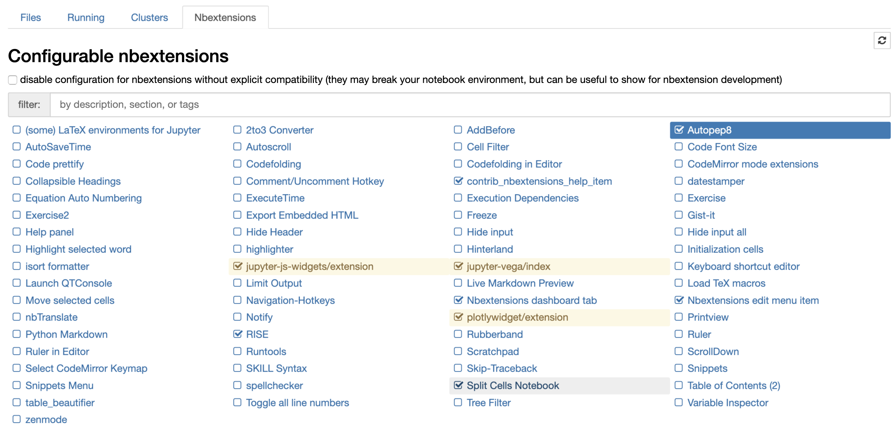

## README

### Export to HTML slides (using Reveal.js)

Run this in a Terminal (command-line) inside this folder (that contains Lecture.ipynb).
Note that the HTML files will expect to see any images/assets you have in the same place as the jupyter notebook.
In other words, you will need to keep the .html file in this folder (or include the images in the same directory).

> jupyter nbconvert Lecture.ipynb --to slides
### Requirements:

- Install jupyter_contrib_nbextensions:
	- `pip install jupyter_contrib_nbextensions` OR 
	- `conda install -c conda-forge jupyter_contrib_nbextensions`

- Install Javascript and CSS files
	- `jupyter contrib nbextension install --user`

- Install jupyter_nbextensions_configurator
	- `pip install jupyter_nbextensions_configurator` and `jupyter nbextensions_configurator enable --user`
	- `conda install -c conda-forge jupyter_nbextensions_configurator`

- Enable the "Split Cells Notebok", see image below

The instructions above are outlined in detailed [here](https://jupyter-contrib-nbextensions.readthedocs.io/en/latest/install.html).
